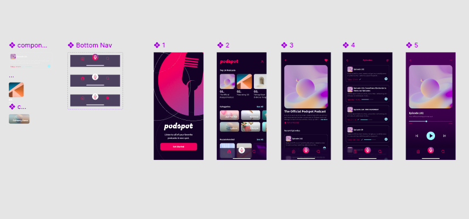
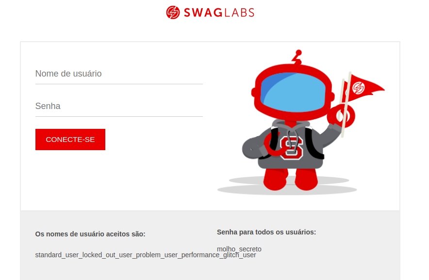

# Portfólio

Esse projeto tem como finalidade mostrar o meu trabalho de análise de requisitos e plano de teste.

Neste portfólio você irá encontrar a análise de dois (2)projetos, sendo um:

- Análise de requisitos de um protótipo Figma
- Plano de teste de um site

## Portifólio Análise de requisitos

- Protótipo do figma
  [PodcastApp](https://www.figma.com/design/ECIzSfAWHcPJSi3HxkKdUr/PodcastAppChallenge?node-id=8-5911&p=f&t=CVCMB6Cis3AGpPTf-0)

## Portifólio Plano de teste

- Site usado para elaboração do plano [saucedemo](https://www.saucedemo.com/v1/)

